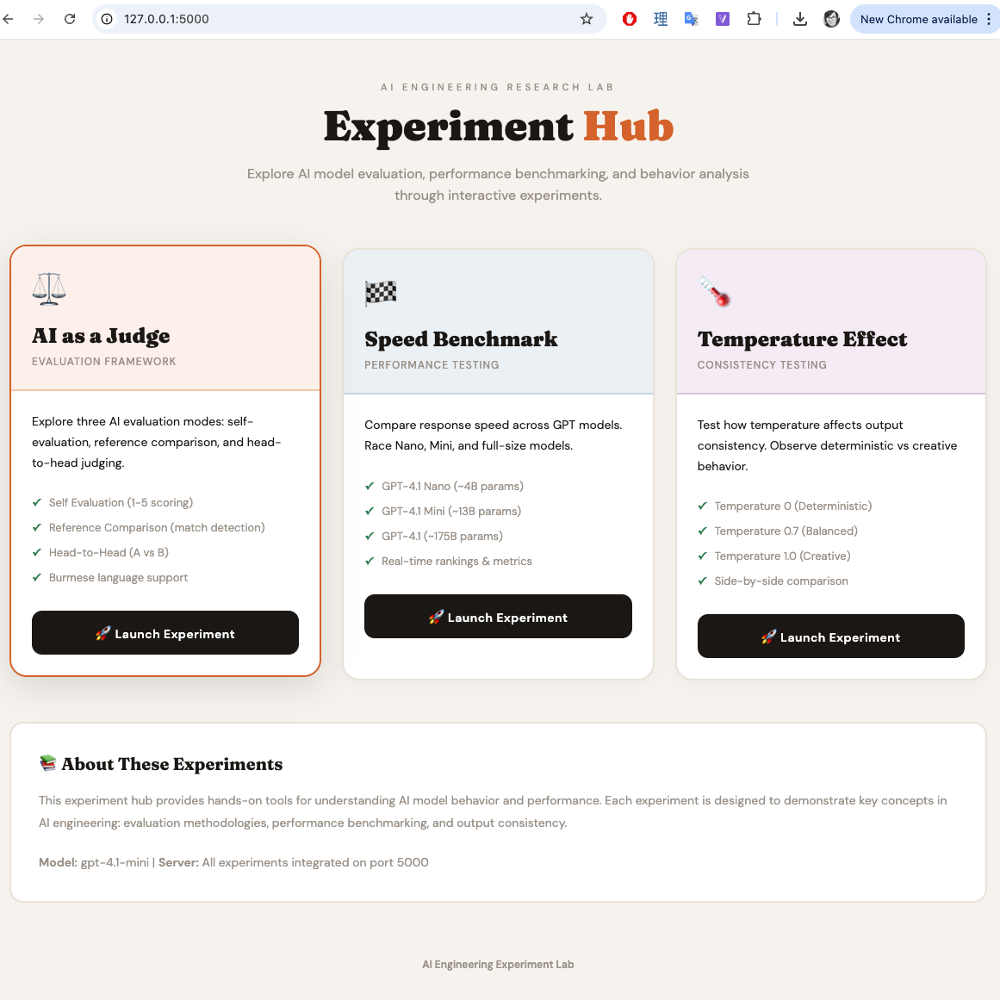
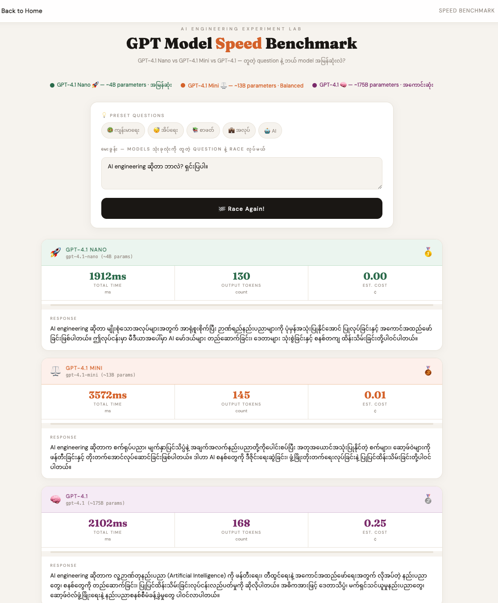
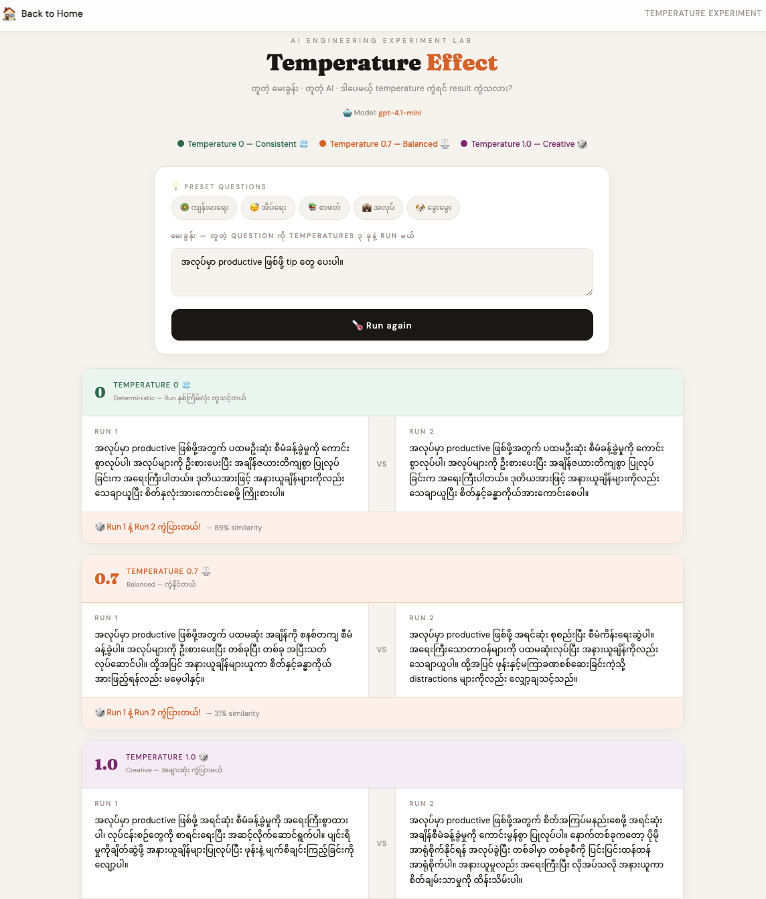

# AI Evaluation Experiments - Visual Guide

A step-by-step guide to using the AI Engineering Evaluation Experiments platform with screenshots and detailed explanations.

---

## 🏠 Getting Started

### Launch the Application

```bash
python app.py
```

Visit: **http://127.0.0.1:5000/**

---

## Home Page



The **Experiment Hub** landing page provides access to all three web experiments:

### Features:
- 🎨 **Beautiful Design**: Clean, modern interface with color-coded experiment cards
- 🧭 **Easy Navigation**: Click any card to launch that experiment
- 📊 **Quick Overview**: Each card shows key features and capabilities
- 🔄 **Integrated System**: All experiments run on a single server

### Available Experiments:
1. **⚖️ AI as a Judge** — Evaluation framework (Orange)
2. **🏁 Speed Benchmark** — Performance testing (Blue)
3. **🌡️ Temperature Effect** — Consistency testing (Purple)

---

## Experiment 1: AI as a Judge ⚖️


### Purpose
Test AI evaluation methodologies by having AI generate and judge its own answers.

### Three Evaluation Modes:

#### 1️⃣ Self Evaluation
- **What it does**: AI generates an answer, then scores it (1-5 scale)
- **Use case**: Quality assessment without ground truth
- **Output**: Score + reasoning

**How to use:**
1. Select a preset question or enter your own (in Burmese)
2. Click **"🤖 Step 1: Generate Answer"** — AI creates an answer
3. Click **"⚖️ Step 2: Judge It!"** — AI evaluates the answer
4. View the score (⭐ 1-5) and reasoning

#### 2️⃣ Reference Comparison
- **What it does**: Compare AI-generated answer against a reference answer
- **Use case**: Accuracy verification
- **Output**: Match (✅/❌) + reasoning

**How to use:**
1. Select preset or enter question + reference answer
2. Click **"🤖 Step 1: Generate Answer"** — AI creates its answer
3. Click **"🔍 Step 2: Compare!"** — AI judges if it matches reference
4. View verdict: MATCH ✅ or NO MATCH ❌

#### 3️⃣ Head-to-Head
- **What it does**: AI generates two different answers and picks the winner
- **Use case**: Comparative quality assessment
- **Output**: Winner (A or B) + reasoning

**How to use:**
1. Enter or select a question
2. Click **"🤖 Step 1: Generate Both"** — AI creates Answer A and Answer B
3. Click **"⚔️ Step 2: Battle!"** — AI decides which is better
4. View winner (🔵 A or 🟡 B) and explanation

### Key Features:
- 🇲🇲 **Burmese Language Support**: Questions and answers in Myanmar language
- 📋 **Preset Templates**: Quick-start questions for testing
- 🎯 **Clear Reasoning**: AI explains every judgment
- 🔄 **2-Step Process**: Generate first, then judge

### Insights:
This experiment demonstrates:
- AI can evaluate quality of responses
- Different evaluation methods have different use cases
- Self-evaluation is useful but has limitations (AI may be biased)
- Reference comparison is more objective
- Head-to-head reveals relative quality differences

---

## Experiment 2: Speed Benchmark 🏁



### Purpose
Compare response speed, token usage, and cost across different GPT model sizes.

### Models Tested:
1. **🚀 GPT-4.1 Nano** (~4B params) — Smallest, fastest, cheapest
2. **⚖️ GPT-4.1 Mini** (~13B params) — Balanced
3. **🧠 GPT-4.1** (~175B params) — Largest, most capable

### How It Works:

**Step 1: Enter Question**
- Select a preset question or write your own
- Question is sent to all three models simultaneously

**Step 2: Race Results**
The system measures three models racing to answer:

#### Metrics Displayed:
1. **Total Time** (ms) — How fast the model responded
2. **Output Tokens** — Number of tokens generated
3. **Est. Cost** (¢) — Estimated cost per query

#### Visual Elements:
- **🥇🥈🥉 Rankings** — Gold, silver, bronze medals
- **Speed Bars** — Visual comparison of relative speeds
- **Full Responses** — Complete answer from each model
- **Insights Summary** — Analysis of results

### How to Use:
1. Select or enter a question in Burmese
2. Click **"🏁 Start Race!"**
3. Watch as each model generates its answer (progress shown)
4. Compare results across all three metrics
5. Read the insight summary at the bottom

### Key Insights:
- **Nano is fastest** but may have simpler answers
- **Mini balances** speed, quality, and cost
- **Full GPT-4.1** is slowest but most comprehensive
- Network conditions affect results
- **Cost varies dramatically**: Nano is ~50x cheaper than full GPT-4.1

### Use Cases:
- Choosing the right model for your application
- Understanding cost-performance tradeoffs
- Testing real-world latency
- Optimizing for speed vs quality

---

## Experiment 3: Temperature Effect 🌡️



### Purpose
Understand how the temperature parameter affects output consistency and creativity.

### Temperature Settings:

#### 🧊 Temperature 0.0 (Deterministic)
- **Behavior**: Always picks the most likely token
- **Result**: Should produce identical outputs every time
- **Use case**: Tasks requiring consistency (evaluation, factual Q&A, code generation)

#### ⚖️ Temperature 0.7 (Balanced)
- **Behavior**: Some randomness, but still controlled
- **Result**: Varied outputs with similar meaning
- **Use case**: General conversation, content generation

#### 🎲 Temperature 1.0 (Creative)
- **Behavior**: High randomness in token selection
- **Result**: Very diverse outputs
- **Use case**: Creative writing, brainstorming, diverse perspectives

### Experimental Design:

**The Test:**
For each temperature setting:
1. Run the same question **twice** (Run 1 and Run 2)
2. Compare the two outputs side-by-side
3. Calculate similarity percentage
4. Determine if outputs are exactly identical

### How to Use:
1. Enter or select a question
2. Click **"🌡️ Run with all 3 temperatures"**
3. Wait as system runs 6 total queries (2 per temperature)
4. Compare Run 1 vs Run 2 for each temperature
5. Read similarity analysis and verdict

### What You'll See:

#### For Each Temperature:
- **Left Column**: Run 1 output
- **VS Divider**: Comparison indicator
- **Right Column**: Run 2 output
- **Verdict Bar**:
  - ✅ **MATCH** (100% similarity) — Outputs are identical
  - 🎲 **DIFFERENT** (X% similarity) — Outputs vary

#### Summary Insights:
At the bottom, you'll see:
- Which temperatures produced identical outputs
- Which temperatures showed variation
- Explanation of why this matters for AI engineering

### Key Findings:
- **T=0.0 should be deterministic**: Both runs match exactly
  - If they don't match, note this behavior in your model
- **T=0.7 usually varies**: Similar ideas, different wording
- **T=1.0 varies most**: Completely different approaches possible

### Real-World Applications:
- **T=0 for AI judges**: Need consistent evaluation criteria
- **T=0 for testing**: Reproducible results
- **T=0.7 for chatbots**: Natural variation
- **T=1.0 for content**: Creative diversity

### Important Note:
Temperature doesn't affect:
- Token selection probabilities (just the randomness in sampling)
- Model capabilities
- Factual accuracy (necessarily)

Temperature controls:
- Randomness in choosing among probable tokens
- Output diversity across multiple runs
- "Creativity" or "conservativeness" of responses

---

## 🎓 Learning Objectives

By using these experiments, you'll understand:

### AI Evaluation (Judge Experiment)
- ✅ Different evaluation methodologies
- ✅ Limitations of self-evaluation
- ✅ Importance of ground truth references
- ✅ Comparative vs absolute assessment

### Model Performance (Speed Benchmark)
- ✅ Speed-quality tradeoffs
- ✅ Cost implications of model size
- ✅ Token usage patterns
- ✅ Latency considerations

### Model Behavior (Temperature)
- ✅ How temperature affects outputs
- ✅ Deterministic vs stochastic generation
- ✅ When to use each temperature setting
- ✅ Reproducibility in AI systems

---

## 💡 Best Practices

### General Tips:
1. **Test Multiple Times**: Run experiments several times to see patterns
2. **Compare Results**: Use same questions across experiments
3. **Document Findings**: Note interesting observations
4. **Vary Inputs**: Try different question types and languages

### For AI Judge:
- Start with preset questions to understand behavior
- Try edge cases (very good/bad answers)
- Note how reasoning changes

### For Speed Benchmark:
- Run during different times to account for network variance
- Consider cost implications for production use
- Look at quality, not just speed

### For Temperature:
- Run T=0 multiple times to verify determinism
- Compare quality at different temperatures
- Note when variation is beneficial vs problematic

---

## 🔧 Navigation Tips

### Home Button (🏠)
Every experiment page has a **"Back to Home"** button in the top-left corner. Click it to return to the landing page and switch experiments.

### Browser Back Button
You can also use your browser's back button to navigate between experiments.

### Bookmarking
You can bookmark individual experiments:
- AI Judge: `http://127.0.0.1:5000/ai-judge`
- Speed: `http://127.0.0.1:5000/speed-benchmark`
- Temperature: `http://127.0.0.1:5000/temperature`

---

## 🚨 Troubleshooting

### Experiment Won't Load
- Check that `python app.py` is running
- Verify you're on `http://127.0.0.1:5000/`
- Check console for errors

### API Errors
- Verify `.env` file has valid API keys
- Check your API quota/limits
- Ensure model names are correct

### Slow Performance
- Network latency affects speed tests
- Large models (GPT-4.1) are inherently slower
- Check your internet connection

### Results Don't Match Expected
- Temperature variations are normal (except T=0)
- AI judges can have biases
- Speed varies with network conditions

---

## 📚 Further Learning

### Concepts to Explore:
1. **LLM Evaluation**: Understanding AI-as-a-judge methodology
2. **Model Scaling**: How parameter count affects performance
3. **Temperature Tuning**: Finding optimal settings for tasks
4. **Cost Optimization**: Balancing quality and expense
5. **Prompt Engineering**: Writing better questions

### Experiment Ideas:
- Compare same question in different languages
- Test technical vs creative questions
- Measure consistency over time
- Create your own evaluation criteria

---

## 🎯 Quick Reference

| Experiment | URL | Key Metric | Best For |
|-----------|-----|-----------|----------|
| AI Judge | `/ai-judge` | Score/Match/Winner | Evaluation methods |
| Speed Benchmark | `/speed-benchmark` | Time (ms) | Performance comparison |
| Temperature | `/temperature` | Similarity (%) | Understanding consistency |

---

**Happy Experimenting! 🚀**

For technical details, see the main [README.md](README.md)
